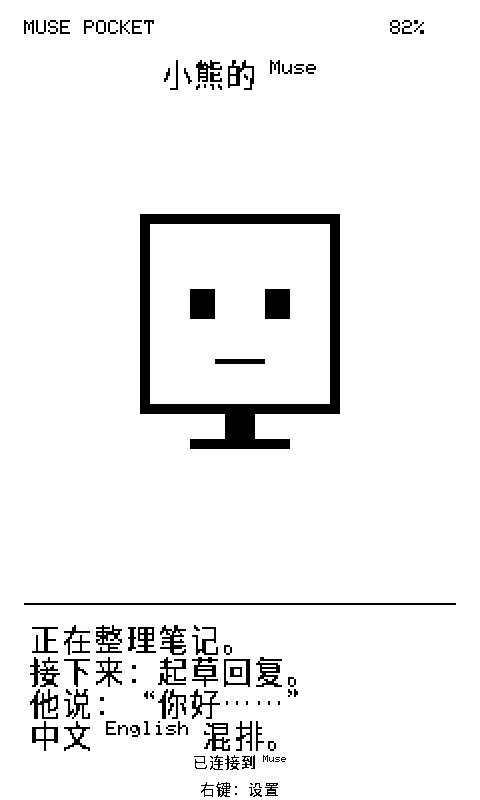
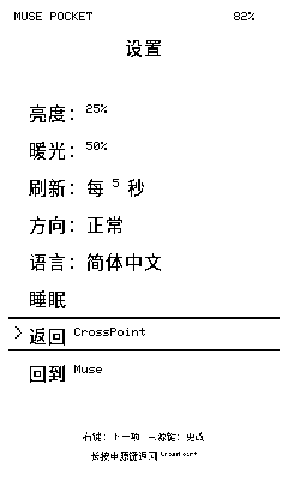

# Muse Pocket 中文版

基于 [Federico Viticci 的 Muse Pocket](https://github.com/viticci/muse-pocket)

把 **阅星瞳 / Xteink X4 Pro** 变成 Muse 随身墨水屏，显示角色图、名字和活动状态。当前 **`v0.1.6-call-zh` 是实验预发布**：配套 CrossMux `1.6.5-x4pro-coexist`，让两个应用槽分别运行 CrossMux 阅读器和中文 Muse Pocket。

这是社区分支，不是 Xteink、Meta 或原作者的官方版本。原 `v0.1.4-zh` 仍用于 CrossPoint 1.6.5 X4 Pro 环境；两个版本的安装与恢复目标不同，不要混用。

**`0.1.6-call-zh` 新功能：左键呼叫 Muse**。用户已在一台国内版 X4 Pro 上确认安装、测试预设呼叫与结果回传正常。长按左键 2 秒触发已配对 Muse 读取用户保存的「X4 Pro 左键预设」；在已配对的设置菜单中触发会先关闭菜单。真实结果通过匹配 `call_id` 的完成命令返回，并在黑白屏分页显示。只有初始化设置尚未完成、且没有等待配对确认时，才保留左键长按 5 秒重置设置；日常使用不清配对，配对确认中长按不确认也不呼叫。设置模板、按键与超时风险见 [左键呼叫指南](docs/call-muse.md)。HTTP 接受请求不等于任务完成，超时显示状态未知且不自动重发；按键不会猜测最近聊天里的任务。

本版本沿用既有受保护 CrossMux `1.6.5-x4pro-coexist`，升级只需要新的配套签署 Muse 模板和本机个人打包，无需重刷 CrossMux。新 Muse 模板见 [0.1.6 发布页](https://github.com/Xi0ng8/muse-pocket-zh/releases/tag/v0.1.6-call-zh)；首次安装仍先按双系统指南使用 0.1.5 发布页的配套 CrossMux。旧版资产与摘要不变。新功能不表示已经替用户在 Muse 中保存预设。

## 刷机风险（安装前必读）

**刷入第三方固件有风险，可能导致设备无法启动、数据丢失或需要额外工具恢复。请理解风险后自行决定安装。** 本项目是社区固件，不是厂商官方升级，也不保证适用于所有 X4 Pro 屏幕与硬件批次。

- **先备份 SD 卡上的书籍、阅读进度与需要保留的文件。** 保持电量充足，更新过程中不要断电、重启或拔卡。
- **只用于 X4 Pro / ESP32-S3。** 首次迁移从准确的 CrossPoint 1.6.5 X4 Pro 开始；不要刷到普通 X4、X3 或其他设备。
- **只使用配套应用镜像，通过 SD 卡应用更新分两阶段安装。** 不要使用完整刷机包、`idf.py flash`，不要改 bootloader、分区表、NVS 或 eFuses。
- **最终双系统不再保留 CrossPoint 槽。** Muse 恢复目标是准确固定的配套 CrossMux；普通 CrossMux Nightly 不能替代它。显示「恢复未验证」或切换失败时停止，不绕过校验。
- 刷错型号、更新中断或破坏恢复槽后，可能需要磁吸 USB 适配器、官方工具或厂商协助；USB 锁定设备的恢复能力可能受限。**保留恢复槽不等于保证任何故障都能恢复。**
- 公开镜像不含 token。个人打包镜像含有你的 SDK token，必须保密；不要上传 GitHub、分享给他人或附到问题报告。

## 中文支持

- 中文与英文混排的 Muse 名字和状态。
- 按屏幕宽度自动换行，不把 UTF-8 字符截断。
- 默认简体中文菜单、配对与连接提示；名字和状态可以中英混排。
- 内置中文字库，不需要先向 SD 卡安装字体。字体覆盖和限制见 [中文说明](docs/chinese.md)。
- 双系统版本精确验证配套 CrossMux；仍保留原 CrossPoint 1.6.5 X4 Pro 的精确摘要，用于旧环境与迁移阶段。

2026-10-08，用户在一台国内版 X4 Pro 上确认专用 CrossMux 启动和双向切换正常。原 `0.1.4-zh` 中文显示已由用户确认。**`0.1.5-coexist-zh` 的 Muse 配对同步、中文阅读及换字体后的实际 Flash 槽摘要尚未单独确认**；不能把构建、主机测试或旧版显示结果扩大为新版本完整实机验收。详见 [共存说明](docs/crossmux-coexistence.md#验证范围) 和 [中文验证记录](docs/chinese.md#验证)。

## 界面预览

以下为 `0.1.4-zh` 的中文显示预览，由实际渲染代码在电脑上生成，使用示例名字与占位角色，并非实机照片。双系统版本的系统切换菜单显示 **切换到 CrossMux**。

## 适用设备

只支持 **X4 Pro / ESP32-S3**，不支持普通 X4、X3。双系统安装完成后只有 CrossMux 和 Muse 两个系统。SD 字体和 PSRAM 字体路径仍可使用；专用配置禁用把另一应用槽用作字体 Flash 缓存，以保护 Muse。

## 安装

按 [双系统逐步安装指南](docs/crossmux-coexistence.md#安装步骤) 操作：先在本机给已签署的公开 Muse 模板加入自己的 token；阶段 A 从原 CrossPoint 更新专用 CrossMux，确认启动；阶段 B 从 CrossMux 更新配套个人 Muse 镜像。每次上传后完整下载回读，核对大小与 SHA256，再进行设备上的 SD 更新。

发布文件与摘要以 [双系统首次迁移发布页](https://github.com/Xi0ng8/muse-pocket-zh/releases/tag/v0.1.5-coexist-zh) 的清单为准，不能根据文件名推断是否配套。第一次使用 Muse 时启用手机 App 的 Developer mode，通过 Add gadget 配对并按阅读器左键确认。已配对设备先检查连接，排查时不要先重置配对。

**个人打包镜像包含你的 token，不能上传 GitHub、分享给别人或附到问题报告。** 发布固件始终不包含 token，每个人必须本机打包自己的副本。

完整按键见 [使用指南](docs/usage.md)，故障处理见 [双系统恢复与风险应对](docs/crossmux-recovery.md)。保留 CrossPoint 的旧版本安装见 [旧版安装指南](docs/install.md)。

## 让 Muse 发送中文状态

> 请在 Muse Pocket 上显示你的角色图，使用 480×480 baseline JPEG 调用 display.draw_url。调用 pocket.set_status 发送简短中文状态，例如「正在整理笔记」。请保持状态随实际活动更新，并说明任何命令失败。

这是给 Muse 的请求，固件不会独立订阅或推断 Muse 的活动。状态最多接收 240 个 UTF-8 字节、显示四行；不支持彩色 emoji。

## 更新与恢复

CrossMux：**设置 → 系统 → 切换到中文 Muse**。Muse：右键打开设置，用右键选中 **切换到 CrossMux**，长按电源 **3 秒**。

日常升级必须使用重新配套、签署的镜像。CrossMux 的普通 OTA 已禁用，SD 更新也只接受配套签署的 Muse；包括开机 DOWN 进入的 SD 恢复模式，**它也不能加载普通 CrossMux 文件来修复 CrossMux 自身**。两槽损坏时需要核实 USB 恢复条件与实际分区，不能假定自动回滚。操作前阅读 [恢复指南](docs/crossmux-recovery.md)。

## 一颗按键可以做什么

先用「呼叫成功，中文正常」测试预设，再在 Muse 里改成你需要的任务：今天的重要事项、待办摘要、笔记阅读卡片、学习抽问，或一个明确授权的工作流程。阅读器负责触发和显示，实际能力取决于 Muse 的工具、数据和权限。

这个版本是抛砖引玉。欢迎在 [Issues](https://github.com/Xi0ng8/muse-pocket-zh/issues) 分享预设模板、玩法和脱敏的屏幕示例，也欢迎提交改进。可参考 [玩法示例](docs/call-muse.md#玩法示例)，请说明需要哪些数据与授权，不分享 token 或个人固件。

## 许可证与贡献

Muse 源自 [Federico Viticci 的 Muse Pocket](https://github.com/viticci/muse-pocket)，保留上游 [Apache-2.0](LICENSE) 和 [依赖声明](NOTICE)。CrossMux 的来源与许可证随配套源码分发，见 [共存说明](docs/crossmux-coexistence.md#来源与许可证)。内置 CJK 字形按 SIL Open Font License 1.1 分发，见 [字体声明](esp32/main/fonts/README.md)。欢迎反馈问题；报告不要包含凭据、私钥或个人安装包。
