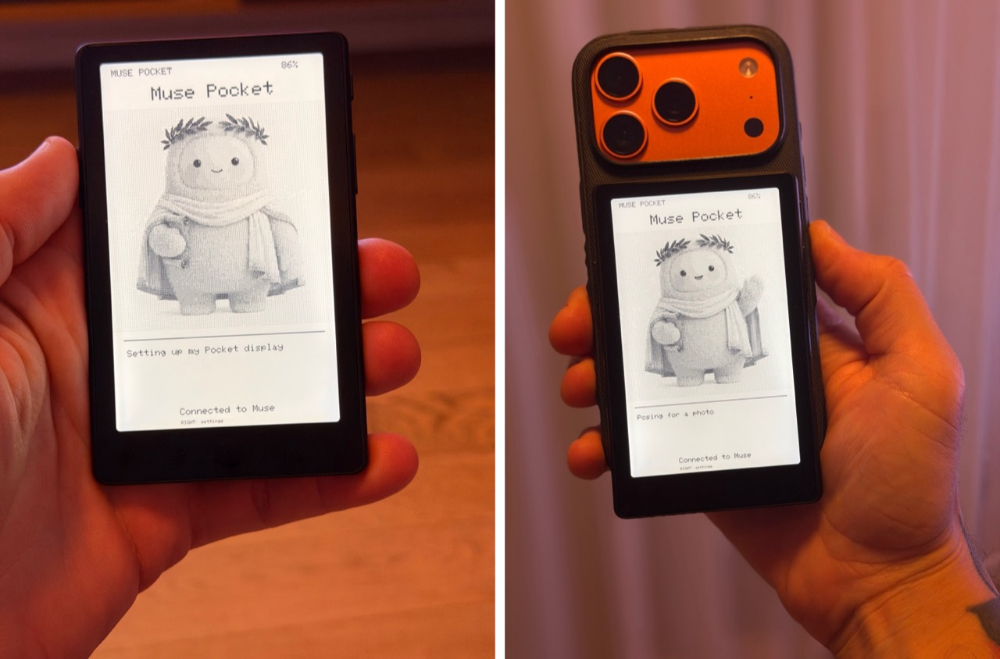
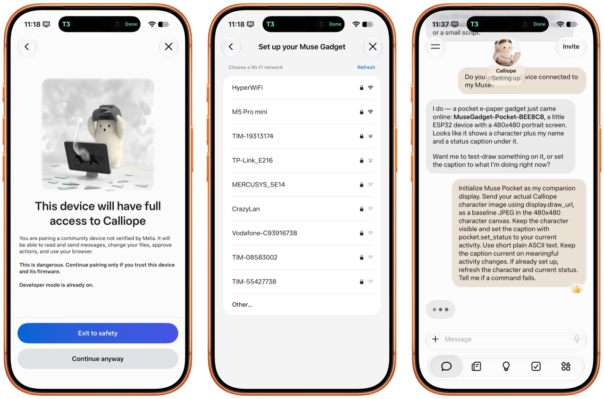

# Muse Pocket

Turn an **Xteink X4 Pro** e-reader into a small e-paper companion for your Muse.
It shows your Muse's character, name and short status updates, with settings for
brightness, warmth, refresh speed, orientation and sleep.

This is a community project built on the
[Muse Gadget SDK](https://github.com/facebookincubator/muse-gadget-sdk).
It is not an official Xteink or Meta product.

## What you need

- An **Xteink X4 Pro**. The ordinary X4 and X3 use different hardware.
- **CrossPoint 1.6.5 for X4 Pro** already installed on the reader.
- A microSD card and a Wi-Fi network, or a way to copy files onto the card.
- The Muse app, Developer mode enabled, and your own
  [Muse SDK token](https://gadgets.muse.ai/settings/sdk-tokens).
- A computer with **ESP-IDF 6.0.1**, Espressif's firmware build tools.

The installation uses CrossPoint's SD firmware updater, so it does not need the
reader's magnetic USB adapter. Get CrossPoint through its
[official installer](https://crosspointreader.com); select the **X4 Pro** build.

## Start here

1. [Build and add your token](docs/build.md). Building creates an uncredentialed
   image; a separate local step adds your token to a private copy.
2. [Install, pair and recover](docs/install.md). Keep CrossPoint in the other
   firmware slot so you can return to it.
3. [Use the display and commands](docs/usage.md).

Every user supplies their own SDK token. No account, Muse name, Wi-Fi network or
computer address is built into this project. **A packaged firmware file contains
your token: keep it private and never attach it to an issue or release.** The
repository contains source only; you do not need someone else's firmware file.

## What appears on the screen

The top shows the Muse's name and battery level. The middle holds a **480×480**
character image. Up to four lines of status text sit below it. Connection state
and the settings shortcut appear at the bottom.

After pairing, the reader sends your Muse one message asking it to display its
character and keep the caption current. Muse supplies these updates by calling
the gadget's commands; the firmware does not independently know what Muse is
doing. The original neutral display icon stays visible until an image arrives.

## Pairing and sending updates

Pairing in the Muse app confirms access to your Muse and lets you choose a Wi-Fi
network. After connecting, ask your Muse to draw its character and update the
status caption. The [command guide](docs/usage.md) explains the image and text
commands, including what to ask if the first update is missing.

The screenshots below show the access confirmation, Wi-Fi selection and a chat
request to send a character and status to the display.

## Buttons

| Button | Main screen | Settings |
| --- | --- | --- |
| Left | Confirm pairing; retry setup | SDK setup control |
| Right | Open settings | Select the next row |
| Power | Clean refresh; hold 3 seconds to sleep | Change the selected setting |

To return to the e-reader, select **Return to CrossPoint** and hold Power for
3 seconds. You can also hold **Right during startup**. See the
[recovery guide](docs/install.md#return-to-crosspoint) before updating.

## Current support

The X4 Pro port has been used on a physical SSD1677 reader with successful Muse
pairing, character/status display and settings. The generic public build is
compiled and tested separately. UC8179 and UC8279 panel drivers are included and
probed, but those variants have not been physically verified by this project.

Text currently uses an ASCII font: accented characters and emoji appear as `?`.
Images are black and white with dithering. Sleep preserves the screen but stops
live updates. The character is held in memory and requested again after restart.
Remote firmware updates are disabled to preserve the CrossPoint recovery slot.

## For contributors and coding agents

Read [CONTRIBUTING.md](CONTRIBUTING.md) and [AGENTS.md](AGENTS.md). The included
[muse-pocket skill](skills/muse-pocket/SKILL.md) covers building, troubleshooting,
token handling and safe app-only updates. Copy the `skills/muse-pocket` directory
to your agent's skill directory, or point your agent at its `SKILL.md` directly.
No personal tools or secret-manager integration are required.

## License and upstream code

Source is under [Apache-2.0](LICENSE), except the dependencies listed in
[NOTICE](NOTICE). X4 Pro display drivers come from
[FreeInk](https://github.com/Free-Ink/freeink-sdk) under MIT; the font and MP3
decoder retain their original licenses. The SDK's license-excluded Jollybot art
is not included; the default display icon is original Apache-2.0 source.

Muse pairing also requires accepting the
[Gadget SDK Terms](https://gadgets.muse.ai/sdk-terms).
